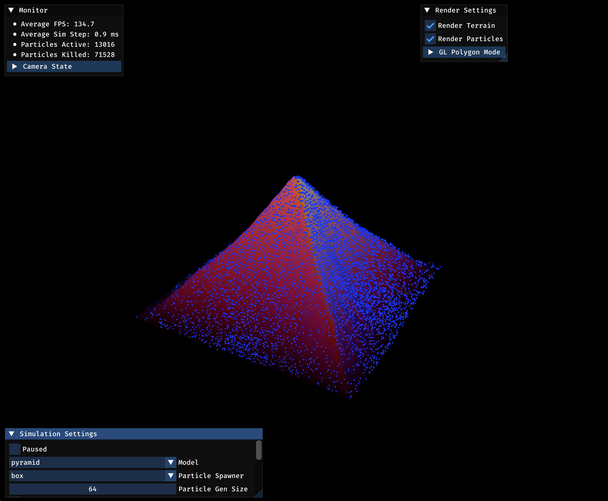

# About
This is a small OpenGL demo that simulates particle-based hydraulic terrain erosion with mass transfer dynamics. A huge source of inspiration for this demo was [Nick's Blog](https://nickmcd.me/2020/04/10/simple-particle-based-hydraulic-erosion/).

See [below](#building--running) for build instructions. See [code structure](#code-structure) below for advice on how to navigate the codebase.




# Usage
This repository _should_ ship with everything required to build and run the application. There may be hiccups on non-macOS systems, since this was the development platform that I used. However, cross-compilation to Windows works flawlessly.

## Zig Version
Compiled with Zig `0.14.0-dev.653+91c17979f`. This is an experimental compiler version; breaking changes may be introduced in future Zig version. It is strictly not backwards compatible.

**Disclaimer:** I developed this on a MacBook Pro M1, macOS 13.6.3 (22G436). I have confirmed that cross-compilation to Windows `zig build --release=fast -Dtarget=x86_64-windows` works.


## Building & Running
Download the latest Zig release for your machine here https://ziglang.org/download/. From here on, I assume that you have this compiler aliased to `zig`.

In the root of this repository, you can compile and launch the application via
```bash
> zig build run --release=fast
```

The GUI interfact should be relatively self-explanatory.

Refer to [build.zig](./build.zig) for the build system implementation -- a great feature of Zig is that you don't need any external build systems (Make, CMake, etc.).


## Tests
In the root of this repository, run
```bash
> zig build test
```

You should not see any console output -- this means that the unit tests have all passed.


# Implementation Details
The general approach is to use a heightmap (2D grid), then run a particle-based hydraulic erosion model over this surface. This allows for simplified physical dynamics while still allowing cool 3D visualizations -- the biggest tradeoff here is that surface geometry complexity is heavily limited (we cannot encode features like curvature on the bottom).

## Focus Areas
My primary interests with this project were:
- Visualization. Full 3D visualization via OpenGL.
- Realtime performance. At least 60 FPS.
- Plausible looking erosion. Something better than completely destroying surface material on particle collision with the surface. 


# Code Structure
## Build System
The build system is written in Zig itself and is fairly well documented in the [build.zig](./build.zig) and [build.zig.zon](./build.zig.zon) files.

## Application
- The entrypoint is [src/app.zig](./src/app.zig).
    - [src/app-state.zig](./src/app-state.zig) is the mega-struct that contains all data that needs to be shared across various systems. From here, you can trace to both the rendering and simulation systems' data.

- [src/simulation/](./src/simulation/) contains the particle simulation system code. This is the next most important part of the codebase after the entrypoint.

- [src/render/](./src/render/) contains the primary rendering system code. Note that the main rendering loop is still in [src/app.zig](./src/app.zig).

- [src/shaders/](./src/shaders/) contains the GLSL source for vertex and fragment shaders used in the rendering pipeline.

- [src/utils/](./src/utils/) contains some helper code for memory management and profiling.


# Dependencies & References
This project depends on:
- [OpenGL 3.3](https://www.opengl.org/)
- [GLFW](https://www.glfw.org/)
- [Dear Imgui](https://github.com/ocornut/imgui)

For each of these, I used the fantastic Zig wrappers maintained by the [zig-gamedev project](https://github.com/zig-gamedev/zig-gamedev).

The following resources proved very helpful:
- [learnopengl tesselation articles](https://learnopengl.com/Guest-Articles/2021/Tessellation/Height-map) for details on triangulating a heightmap into a mesh for rendering.
- [Simple Particle-Based Hydraulic Erosion](https://nickmcd.me/2020/04/10/simple-particle-based-hydraulic-erosion/) for a great conceptual intro to hydraulic erosion simulations, which I was unfamiliar with at the start of this project.
